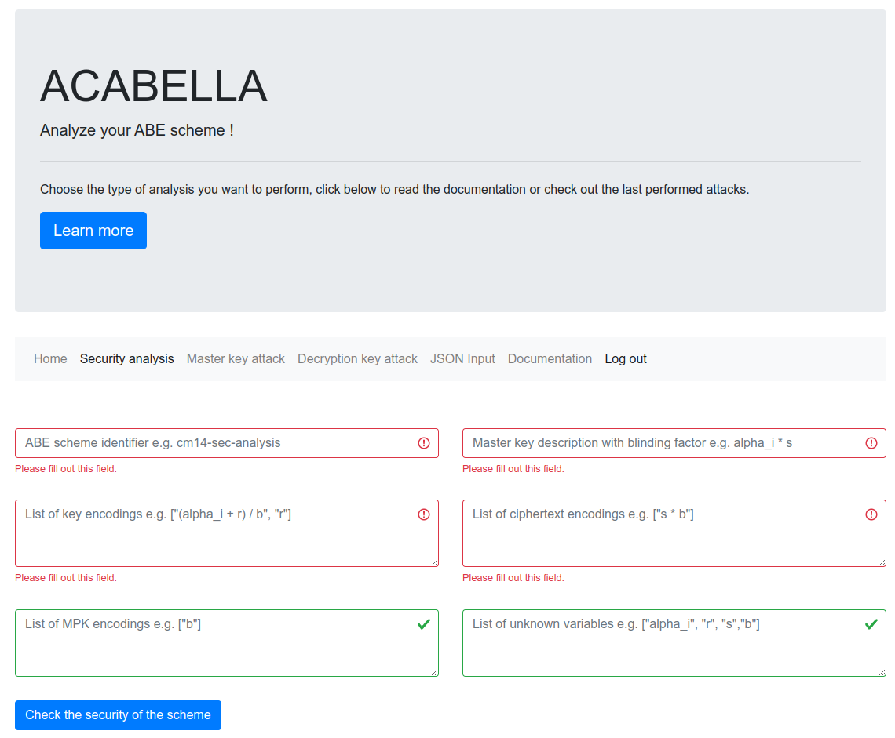

## Tools provided by ACABELLA

ACABELLA provides different tools to analyze the security of ABE schemes:

### ACABELLA analysis command line tool

It receives a JSON input describing an ABE scheme and analyzes its security.

```bash
[*] ACABELLA cmd tool
usage: acabella_cmd.py [-h] -a {mk,da,sec,cond,all,comp} -c CONFIG

options:
  -h, --help            show this help message and exit
  -a {mk,da,sec,cond,all,comp}, --analysis {mk,da,sec,cond,all,comp}
                        Select the type of analysis to perform: mk for master key
                        attack, da for decryption attack, ac17 for security analysis,
                        cond for conditional attack, all for performing every
                        analysis type and comp for only running attacks whenever the
                        scheme is detected as insecure
  -c CONFIG, --config CONFIG
                        Configuration file for the analysis type in ACABELLA JSON
                        format
```

For instance, to look for master-key attacks we can use the following JSON input file:

```json
{
    "scheme_id": "cm14",
    "analysis": "master_key",
    "k": ["alpha + r * b", "r"],
    "master_key": "alpha",
    "unknown_vars" :  ["alpha", "b", "r"],
    "corruption_model" : "CA",
    "corruptable_vars": [
        { "type":"MPK_CA", "var":"b" }
         ],
    "MPK_CA": ["b"],
    "MSK_CA": ["alpha"],
    "MPK_AA": [],
    "MSK_AA": [],
    "MPK_vars": [],
    "GP_vars": []
} 
```

An example utilization in this case would be:

```bash
$ python acabella_cmd.py -a mk -c examples/lxxh16_config json                                                             

[*] ACABELLA cmd tool
[*] Analyzing scheme...

List of encodings:
         k0 : alpha + b*r
         k1 : r

For the corruption of the Central Authority.

Structure of CA/AAs:
        Contents of the CA MPK: [b]
        Contents of the CA MSK: [alpha]

List of variables obtained via corruption:
        b from MPK_CA

[*] Master key attack with corruption found: 1*k0 + -b*k1
```

The `comp` mode first analyzes the security of the scheme, then according to the result, it can decide to look for existing attacks in the scheme or not.

### ABGW docker tool

It invokes the ABGW ggm analyzer proposed by [ABGW17] in a docker container and
analyzes the inputs provided in `solver_inputs`.

Located at `tools/abgw_docker`, it invokes the ABGW tool with ABE schemes defined in the `solver_inputs` directory.
Note that the `build_and_run.sh` script compiles the image defined in the docker file and launch a container image where ABGW is executed.

For instance:

```bash
$ ./build_and_run.sh               
Sending build context to Docker daemon  48.13kB
Step 1/27 : FROM ubuntu:16.04
 ---> b6f507652425
Step 2/27 : RUN apt update -y
 ---> Using cache
 ---> 1688783f3dcc
Step 3/27 : RUN ln -fs /usr/share/zoneinfo/America/New_York /etc/localtime
 ---> Using cache
 ---> 0dbe43f37870
Step 4/27 : RUN apt-get install -y tzdata
 ---> Using cache
 ---> e3f3790737f4
Step 5/27 : RUN dpkg-reconfigure --frontend noninteractive tzdata
 ---> Using cache
 ---> e6d34b8176ad
Step 6/27 : RUN apt-get --assume-yes install software-properties-common
 ---> Using cache
 ---> 9ed00e1180b3
Step 7/27 : RUN echo "export GGM_PATH=/root/ggm-symbolic-solver" >> /etc/bash.bashrc
 ---> Using cache
 ---> c09a02d4d6f1
Step 8/27 : RUN apt install git vim build-essential sudo python3-dev wget flex bison python3-pip libssl-dev libgmp10 libgmp-dev git openssl -y
 ---> Using cache
 ---> 0107f2df09fb
Step 9/27 : RUN apt-get install -y curl ocaml ocaml-native-compilers opam libtool libtool-bin libgmp-dev libffi-dev m4 libz-dev libssl-dev camlp4-extra
 ---> Using cache
 ---> 629689e6d19b
Step 10/27 : WORKDIR /root
 ---> Using cache
 ---> d79f0bee8e6f
Step 11/27 : RUN git clone https://github.com/miguel-ambrona/ggm-symbolic-solver
 ---> Using cache
 ---> 1a87191dcd28
Step 12/27 : WORKDIR /root/ggm-symbolic-solver
 ---> Using cache
 ---> d9117f162a43
Step 13/27 : RUN opam init --yes
 ---> Using cache
 ---> ea83d8958f44
Step 14/27 : RUN eval `opam config env`
 ---> Using cache
 ---> 3744bac4bc53
Step 15/27 : RUN opam pin add symbolic-solver . -n --yes
 ---> Using cache
 ---> 57ee5bb1a57a
Step 16/27 : RUN opam install symbolic-solver --deps-only --yes
 ---> Using cache
 ---> d151dd1a053f
Step 17/27 : RUN export GGM_PATH=/root/ggm-symbolic-solver/
 ---> Using cache
 ---> fc1963909dd5
Step 18/27 : RUN apt-add-repository -y ppa:aims/sagemath
 ---> Using cache
 ---> d74a3b71a915
Step 19/27 : RUN apt-get update -y
 ---> Using cache
 ---> e66d9de8839d
Step 20/27 : RUN apt-get --assume-yes install sagemath-upstream-binary
 ---> Using cache
 ---> 0dc912223b53
Step 21/27 : COPY ggm_setup.sh/ .
 ---> Using cache
 ---> 54581c89d3eb
Step 22/27 : RUN chmod +x ggm_setup.sh
 ---> Using cache
 ---> 99be81b5d1b0
Step 23/27 : RUN ./ggm_setup.sh
 ---> Using cache
 ---> 2caff98e273d
Step 24/27 : RUN rm -rf examples/*
 ---> Using cache
 ---> ff8f9b8c477b
Step 25/27 : COPY solver_inputs/* examples/
 ---> Using cache
 ---> 4df8886f035e
Step 26/27 : COPY changes/* .
 ---> Using cache
 ---> c62e8b35a2c7
Step 27/27 : CMD ["/bin/bash"]
 ---> Using cache
 ---> eb18b1849e3d
Successfully built eb18b1849e3d
Successfully tagged abeattacks:latest


[*] Now run run_examples.py

root@5f232cb06e7c:~/ggm-symbolic-solver# 
root@5f232cb06e7c:~/ggm-symbolic-solver# ./run_examples.py 

Initialized solver!

./examples/cp_abe_ndcw15.ggm  Complete output:
[...]
```   

### ABGW bridge

We also provide a ABGW bridge in our toolset.
This bridge translates ACABELLA's JSON format for describing ABE schemes into a valid
input to the ABGW tool. This tool then analyzes single-key security in the generic group model.    
    
Located at `tools/abgw_bridge`, it receives a description    
of an ABE scheme written in JSON, for instance, for the YJR13 scheme:    
    
```json    
{    
    "scheme_id": "yjr13",    
    "analysis": "abgw",    
    "k": ["a * (1 / x1) + x2 * b + r * (b / bp)", "r * bp * (1 / x1)", "r * b"],    
    "c": ["s", "s / bp"],    
    "mpk": ["bp"],    
    "gp": ["b"],    
    "key" : "a * s",    
    "unknown_vars" :  ["a", "r", "s", "b", "bp"],    
    "known_vars" : ["x1", "x2"]    
}    
```    

It can be used to obtain the corresponding input for ABGW, for instance:
    
```bash
$ python abgw_bridge_cmd.py example.json 
[*] ABGW bridge cmd tool
[!] Processing example.json

params c1,c2,c3,c4,c5,c6 in Zp.
vars a,r,s,b,bp in Zp.
params x1,x2 in Zp.


c1*(a*s/x1 + b*s*x2 + b*r*s/bp) +
c2*(a*s/(bp*x1) + b*s*x2/bp + b*r*s/bp*bp) +
c3*(bp*r*s/x1) +
c4*(r*s/x1) +
c5*(b*r*s) +
c6*(b*r*s/bp)
= a * s.

go.
```


### ACABELLA web application

It provides a web interface for analyzing the security of ABE schemes.
The prototype can be launch from tools/acabella_web via
flask:

```
#!/bin/sh

flask --app flaskr --debug run
```

Note that the requirements listed at `tools/acabella_web/requirements.txt` must be installed.



